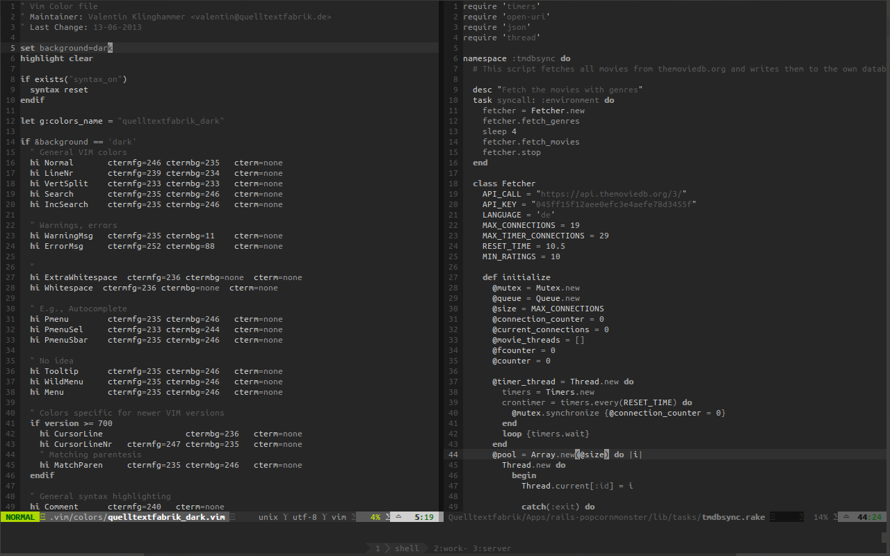

# Vim Quelltextfabrik Color Scheme
## Description
This scheme contains a light and a dark version an is optimized for 256 bit

## Installation
### Manually
Copy quelltextfabrik_light.vim and quelltextfabrik_dark.vim to ~/.vim/colors/

Extend your .vimrc by using

    colorscheme quelltextfabrik_dark

### Vundle
Add this to your Vundle definition, e.g. in your .vimrc:

    Bundle 'Quelltextfabrik/vim-quelltextfabrik-theme'

Then after that, change the theme in your .vimrc

    colorscheme quelltextfabrik_dark

_Attention!_ Switch the colorscheme after running Vundler in you .vimrc!

## Screenshots
### Tiger
If you work through the night, this theme is for you. The dark, low contrast version of this theme is sure to keep your eyes relaxed as much as possible.

### Grizzly
If you work in bright conditions, like outside in the sun, then this theme is for you. Maximum contrast should help you to see everything you need.

